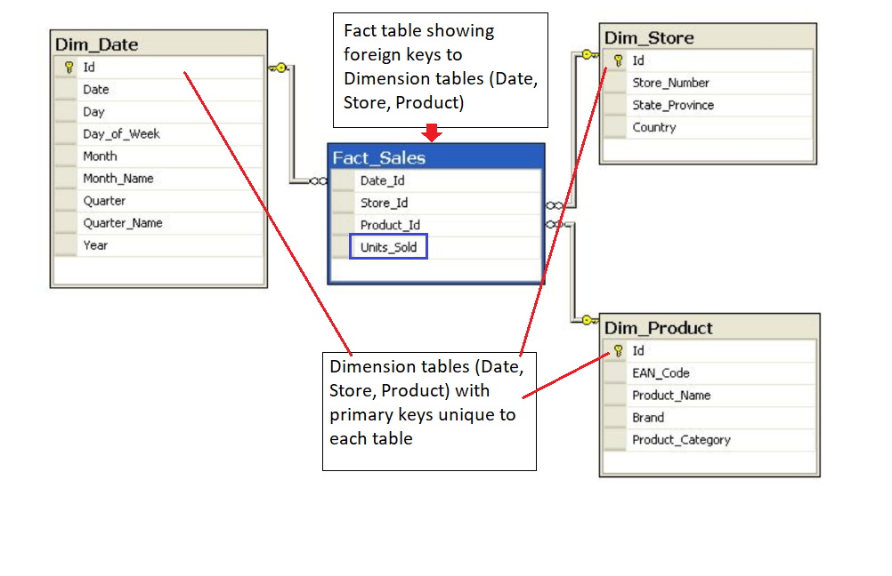
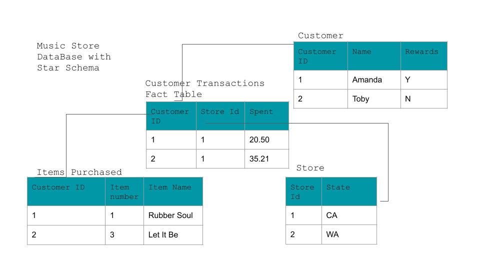

 

# 📘 ReadMe: Fact and Dimension Tables in Data Modeling

Fact and dimension tables form the foundation of **dimensional modeling** in relational databases, especially in **data warehouses** and **business intelligence systems**.

---

## 🧠 Conceptual Overview

* Fact and dimension tables are **not created differently in SQL (DDL)** — they are **conceptual roles** that tables play in the data model.
* These concepts **leverage normalization and denormalization** to support efficient querying and reporting.

---

## 📊 Fact Tables

### ✅ Purpose:

* Store **quantitative data**: metrics, measurements, or facts related to a business process.
* Represent **events that have occurred**, like transactions or sales.

### 🔍 Key Characteristics:

* Contain **numerical data** used for **analysis and aggregation**.
* Typically **not updated frequently** — append-only in many cases.
* Include **foreign keys** to connect with dimension tables.

### 🧱 Example:

| Transaction\_ID | Date\_ID | Customer\_ID | Product\_ID | Amount\_Spent |
| --------------- | -------- | ------------ | ----------- | ------------- |
| 1001            | 20250710 | 1234         | 5678        | 89.99         |

---

## 🗂️ Dimension Tables

### ✅ Purpose:

* Provide **context** to facts by categorizing and describing them.
* Answer **“who, what, where, when”** about the data in the fact table.

### 🔍 Key Characteristics:

* Contain **descriptive attributes**, typically **textual** or **non-measure** values.
* Updated more frequently than fact tables (e.g., customer name or address).
* Used in **JOINs** with fact tables via **foreign keys**.

### 🧱 Example:

**Customer Table**

| Customer\_ID | Name       | City       | Email                                           |
| ------------ | ---------- | ---------- | ----------------------------------------------- |
| 1234         | Amanda Lee | Austin, TX | [amanda@example.com](mailto:amanda@example.com) |

---

## 🧩 Schema Types

### 🌟 Star Schema

* **Fact table in the center**, surrounded by **denormalized dimension tables**.
* Simple, flat structure.
* Best for **performance and simplicity** in reporting tools.

```
         [Customer]
             |
[Product] — [Fact_Sales] — [Date]
             |
         [Store]
```

### ❄️ Snowflake Schema

* Like a star schema but with **normalized dimension tables**.
* More complex, can save space and improve **data integrity**.

---

## 🔁 Relationships

* **One-to-many**: One dimension record connects to many fact records.
* Example: One `Customer_ID` in the dimension table could link to many `Transaction_ID`s in the fact table.

---

## 💼 Business Relevance

These tables help businesses:

* Track and analyze sales, performance, and trends.
* Answer analytical questions like:

  * "How much did each customer spend this month?"
  * "Which products sold best in Q2?"

---

## 📌 Key Takeaways

| Concept      | Fact Table                       | Dimension Table                       |
| ------------ | -------------------------------- | ------------------------------------- |
| Contains     | Measures, metrics (e.g., totals) | Descriptive info (e.g., names, dates) |
| Type of Data | Numeric, additive                | Textual, categorical                  |
| Purpose      | Analyze events                   | Provide context                       |
| Frequency    | Updated less often               | Updated more often                    |
| Keys         | Foreign keys to dimensions       | Primary keys (used in joins)          |

---

Let me know if you’d like diagrams, example SQL schemas, or help modeling a real business scenario using these concepts!



---

# ⭐ ReadMe: Star Schema – Benefits, Drawbacks, and Music Store Example

The **Star Schema** is a simplified and performance-optimized schema used widely in **data warehouses** and **business intelligence** applications. It enables fast reporting and easier query construction by **denormalizing** dimension data around a central **fact table**.

---

## 🌟 Benefits of the Star Schema

| Benefit                          | Description                                                                                                                                                                    |
| -------------------------------- | ------------------------------------------------------------------------------------------------------------------------------------------------------------------------------ |
| 🧩 **Simplified Querying**       | Queries use **simple JOINs** to connect the central fact table with dimension tables. Greatly reduces complexity compared to deeply normalized schemas.                        |
| 🚀 **Fast Aggregations**         | Common operations like `COUNT`, `SUM`, `GROUP BY`, and `AVG` can be efficiently handled in the **database layer**, reducing the need for calculations in the application code. |
| 💼 **Query Performance**         | Denormalization improves performance for read-heavy workloads and reporting tools by reducing the number of JOINs.                                                             |
| 🔧 **Flexibility for BI Tools**  | Star schemas are optimized for tools like Tableau, Power BI, and Looker, making them easy to plug into dashboards and reports.                                                 |
| 📉 **Reduced Application Logic** | Business rules for aggregation and filtering can often be handled directly in SQL rather than being coded in your application.                                                 |

---

## ⚠️ Drawbacks of the Star Schema

| Drawback                                           | Description                                                                                                                                                  |
| -------------------------------------------------- | ------------------------------------------------------------------------------------------------------------------------------------------------------------ |
| 🔁 **Data Integrity Risks**                        | Denormalization introduces **data duplication**, which increases the chance of **inconsistencies** if updates aren't carefully managed.                      |
| 🎯 **Reduced Query Flexibility**                   | Schema is modeled **to fit specific queries**, so **ad hoc querying** and evolving analytical needs may be harder to accommodate.                            |
| 🔀 **Poor Handling of Many-to-Many Relationships** | Star schema simplifies or avoids many-to-many relationships, often **abstracting them away** or converting them to fit a one-to-many model.                  |
| 🔄 **Redundant Data Storage**                      | Data like customer names, product details, etc., may be repeated across dimension tables, increasing storage needs (though this is less of a concern today). |

---

## 🎵 Example: Music Store Star Schema

Imagine a **Music Store Database** modeled using a **Star Schema**.

### 🧱 Fact Table: `Customer_Transactions`

Central table with measurable data:


---


# ❄️ ReadMe: Snowflake Schema – Concepts, Structure, and Comparison

The **Snowflake Schema** is a **logical arrangement of tables** used in **data warehouses** and **multidimensional modeling**, offering more **normalized** structure than a star schema.

---

## ❄️ What Is a Snowflake Schema?

* A **central fact table** is surrounded by multiple **normalized dimension tables**.
* Dimension tables are **split into related sub-dimensions**, creating a **snowflake-like structure**.
* Designed to reduce **data redundancy** and improve **data integrity** by **normalizing dimension data**.

```
                    [Region]
                        |
          [Country] — [Customer]
                        |
       [Time] — [Fact_Sales] — [Product] — [Category]
```

---

## 🧱 Structure Overview

| Component          | Description                                                                                   |
| ------------------ | --------------------------------------------------------------------------------------------- |
| **Fact Table**     | Stores **measurable metrics** or events (e.g., sales, orders, revenue).                       |
| **Dimension**      | **Normalized tables** describing attributes (e.g., product, customer info).                   |
| **Sub-dimensions** | Breakdowns of dimension tables, introducing **hierarchies** and **relationships** among them. |

---

## ⚖️ Snowflake vs Star Schema

| Feature                       | ⭐ Star Schema                 | ❄️ Snowflake Schema                          |
| ----------------------------- | ----------------------------- | -------------------------------------------- |
| **Normalization**             | Low (denormalized)            | Higher (normalized to 1NF or 2NF)            |
| **Data Redundancy**           | Higher                        | Reduced                                      |
| **Query Performance**         | Fast (fewer joins)            | Slower (more joins due to normalized tables) |
| **Query Simplicity**          | Easy to write                 | More complex due to normalized relationships |
| **Storage Space**             | Larger (due to repeated data) | Smaller (less duplication)                   |
| **Support for Hierarchies**   | Not ideal                     | Better suited for multi-level hierarchies    |
| **One-to-Many Relationships** | Not supported directly        | Supported via table relationships            |

---

## ✅ Advantages of Snowflake Schema

* 🔄 **Reduces redundancy** and improves **data integrity**
* 🧱 Better support for **hierarchical data modeling** (e.g., Category → Subcategory → Product)
* 🧪 Helpful in environments where **data accuracy and consistency** matter more than query performance

---

## ⚠️ Disadvantages of Snowflake Schema

* 🐢 **Slower performance** for query execution due to **multiple JOINs**
* 🔍 **More complex queries**, especially for business users
* ❌ Not always ideal for **reporting tools** that favor flatter structures

---

## 💡 Use Case Considerations

* Use **Star Schema** for:

  * Dashboards
  * BI tools
  * Fast, read-heavy queries

* Use **Snowflake Schema** when:

  * Data consistency and normalization are priorities
  * You need to model **complex hierarchical relationships**

---

## 🧠 Key Takeaways

* The **Snowflake Schema** is a **more normalized** version of the Star Schema.
* It provides **cleaner structure and consistency**, but at the cost of **query complexity** and sometimes slower performance.
* Star is a **special case** of the snowflake: all dimension tables in the star schema are flattened versions of snowflake dimensions.

